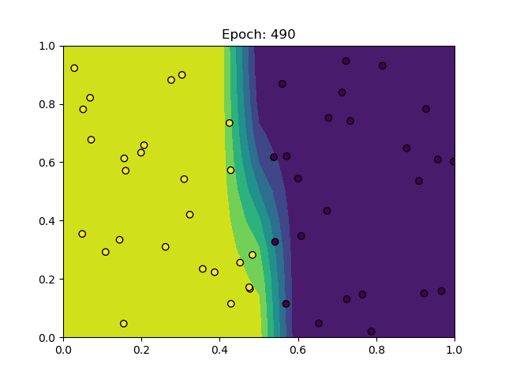
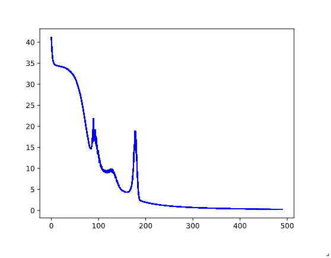
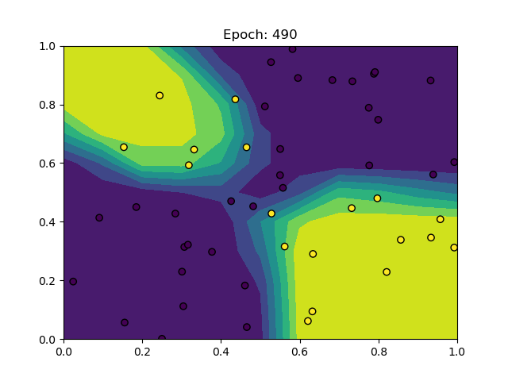
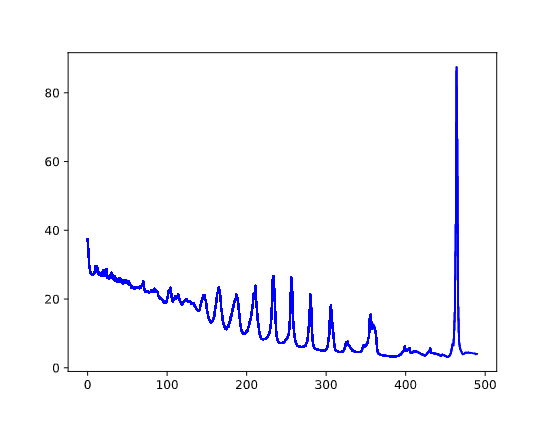

# MiniTorch Module 1

## Tarea 1.5: Entrenamiento

### Simple
~~~
PTS = 50
DATASET = datasets.Simple(PTS, vis=True)
HIDDEN = 2
RATE = 0.5
~~~

### Xor
~~~
PTS = 50
DATASET = datasets.Xor(PTS, vis=True)
HIDDEN = 10
RATE = 0.5
~~~

